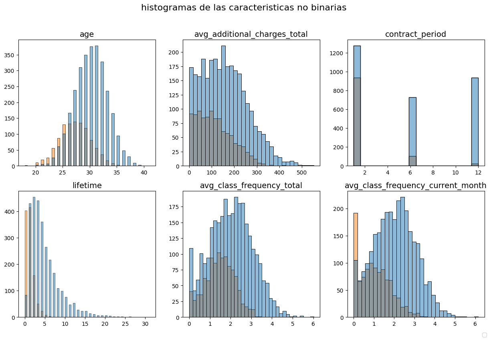
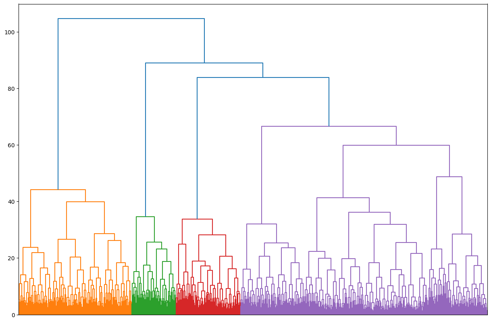

## Análisis de retención de clientes para Model Fitness
La retención de clientes es clave en cualquier industria para garantizar ingresos recurrentes y reducir costos de captación (hasta 5 veces más altos). En Model Fitness, el análisis de factores de retención y cancelación permite anticipar abandonos, crear programas de fidelización basados en datos y ofrecer experiencias personalizadas que aumenten el engagement.

#### Herramientas y tipo de proyecto

### Preguntas Clave
¿Qué variables (demográficas o de uso) impactan más en la cancelación?
¿Cómo difieren los clientes leales frente a los que abandonan?
¿Qué segmentos permiten estrategias de retención personalizadas?

### Metodología
Limpieza de datos: Eliminación de duplicados, valores nulos y estandarización.
EDA: Identificación de patrones en cancelaciones (ej: frecuencia de visita, tipo de contrato).
Modelado predictivo: Logistic Regression (72% precisión) y Random Forest (81%) para predecir cancelaciones.
Clustering: Segmentación con K-means para agrupar clientes por comportamiento.

## Hallazgos Clave
Retención alta: Clientes cercanos al gimnasio, con contratos largos (+6 meses) y participación en clases grupales.
Riesgo de cancelación: Jóvenes con contratos mensuales y baja asistencia.

###Acciones Recomendadas
Incentivar contratos largos: Descuentos por compromisos de 3+ meses.

Impulsar clases grupales: Campañas destacando beneficios sociales y motivacionales.

Intervención temprana: Usar el modelo para alertar sobre clientes en riesgo y ofrecer promociones ad-hoc.

Segmentación inicial: Clasificar nuevos clientes por perfil (edad/contrato) para estrategias preventivas.

## visualizaciones

**histogramas de compararion de de caracteristicas no binarias**
Al examinar los patrones entre clientes que permanecen y aquellos que cancelan, emergen dos tendencias claras:

Patrón de contratación
Los clientes que cancelan muestran una marcada preferencia por compromisos a corto plazo, con una abrumadora mayoría optando por membresías mensuales. En contraste, los clientes leales tienden a seleccionar planes de mayor duración.

Perfil demográfico
Se observa una concentración notable de cancelaciones entre usuarios menores de 30 años, mientras que la base de clientes más estables presenta un rango de edad significativamente mayor.

**clusteres**
El dendrograma revela que los clientes se organizan naturalmente en 4 segmentos diferenciados, agrupados según sus características y patrones de comportamiento clave, lo que permite diseñar estrategias de retención personalizadas para cada perfil.

